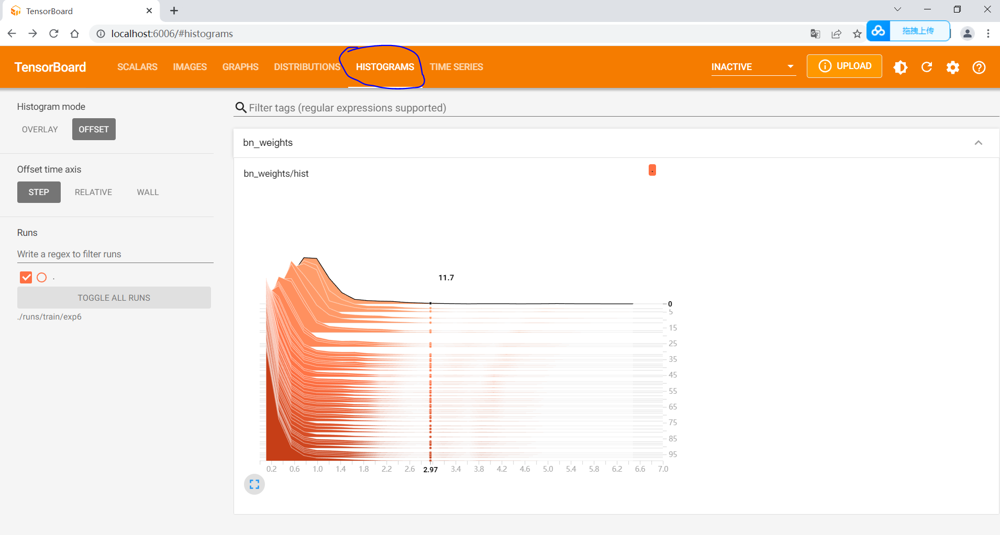

## <div align="center">前言</div>
本项目基于 [yolov5-6.2版本](https://github.com/ultralytics/yolov5/releases/tag/v6.2) 的代码进行剪枝。与原版的yolov5-6.2 相比，本项目将所有剪枝需要的文件集成到了[prune_tools](prune_tools)文件夹，其余部分均相同。
本项目以口罩佩戴检测为例，展示**yolov5n**是如何剪枝的。对于其它系列，是同样的操作，就不再赘述。
  ```shell
 prune_tools/
 ├── finetune.py            # 用于剪枝后的微调
 ├── prune.py               # 开始剪枝yolo模型
 ├── pruned_common.py       # 模型剪枝后的模块
 ├── train_sparity.py       # 稀疏训练
 ├── yolo_pruned.py         # 构建剪枝后的模型
```

本项目的剪枝方法来自于[Learning Efficient Convolutional Networks Through Network Slimming](https://openaccess.thecvf.com/content_iccv_2017/html/Liu_Learning_Efficient_Convolutional_ICCV_2017_paper.html), 此方法根据BN层的γ系数的大小进行剪枝。

1. 首先进行稀疏训练，将BN层的γ系数压至较小的值。

2. 设定剪枝比率，剪枝掉BN层过小的γ系数对应的通道

3. 微调


## <div align="center">使用说明</div>
<details open>
<summary>环境安装</summary>

可以参考本人的[requirements.txt](requirements.txt)下载，**Python=3.9**.

```bash
pip install -r requirements.txt  # install
```

</details>


<details open>
<summary>基础训练</summary>

训练方法可以参考我的博文[Yolov5口罩佩戴实时检测项目（opencv+python推理）](https://blog.csdn.net/weixin_43490422/article/details/127148825?spm=1001.2014.3001.5501)

1. 下载数据集的百度云链接：[mask_yolo](https://pan.baidu.com/s/1l1-lBb_znAYcFmRVDj1IfQ?pwd=glxz)

2. 数据集配置文件[mask.yaml](data/mask.yaml)和模型配置文件[yolov5n_mask.yaml](models/yolov5n_mask.yaml)已经放入到项目中。
   
3. 修改数据集配置文件[mask.yaml](data/mask.yaml)中的path路径为数据集的存放位置

```bash
path: ../datasets/mask_yolo  # 修改为自己的数据集路径
```

4. 开始训练
```bash
python train.py --data data/mask.yaml --cfg models/yolov5n_mask.yaml --weights yolov5n.pt --batch-size 64 --epochs 200 --imgsz 320
```
**训练结果**：

| Class   | Images | Instances | P     |    R  | mAP50 | mAP50-95 | params<br><sup>(M) | GFLOPs<br><sup>@320 |
|------------------------------------------------------------------------------------------------------|-----------------------|-------------------------|--------------------|------------------------------|-------------------------------|--------------------------------|--------------------|------------------------|
| all     | 1839   | 3060      | 0.953|  0.913| 0.949  | 0.657   | 1.77                | 4.2           
| face     | 1839   | 2024      | 0.955|  0.899| 0.935  | 0.633   | --                | --          
| face_mask     | 1839   | 1036      | 0.952|  0.928| 0.963  | 0.681  | --                | --          


</details>


<details open>
<summary>稀疏训练</summary>

```bash
python prune_tools/train_sparity.py --st --sr 0.0005 --weights runs/train/exp3/weights/best.pt --cfg models/yolov5n_mask.yaml --data data/mask.yaml --batch-size 64 --epochs 100 --imgsz 320
```

其中:
1. **weights**: 基础训练得到的best权重文件路径

2. **st**: 是否开启稀疏训练

3. **sr**: 稀疏因子，设置的越大，γ因子靠近0的越多，可以根据直方图的效果以及mAP的表现进行调整

稀疏后的BN层γ权重分布可以通过如下命令，然后手动在浏览器输入http://localhost:6006/  即可。
```bash
tensorboard --logdir=runs/train
```

稀疏后的γ因子直方图如下所示：


**稀疏结果**：

| Class   | Images | Instances | P     |    R  | mAP50 | mAP50-95 | params<br><sup>(M) | GFLOPs<br><sup>@320 |
|------------------------------------------------------------------------------------------------------|-----------------------|-------------------------|--------------------|------------------------------|-------------------------------|--------------------------------|--------------------|------------------------|
| all     | 1839   | 3060      | 0.952|  0.908| 0.949  | 0.642   | 1.77                | 4.2           
| face     | 1839   | 2024      | 0.944|  0.888| 0.936  | 0.622   | --                | --          
| face_mask     | 1839   | 1036      | 0.961|  0.927| 0.961  | 0.663  | --                | --          


</details>


<details open>
<summary>剪枝</summary>


```bash
python prune_tools/prune.py --weights runs/train/exp4/weights/best.pt --percent 0.4 --cfg models/yolov5n_mask.yaml --data data/mask.yaml --batch-size 64 --imgsz 320
```
其中:
1. **weights**: 稀疏训练得到的best权重文件路径

2. **percent**: 指定要剪枝多少比例的参数


**剪枝结果**：

| Class   | Images | Instances | P     |    R  | mAP50 | mAP50-95 | params<br><sup>(M) | GFLOPs<br><sup>@320 |
|------------------------------------------------------------------------------------------------------|-----------------------|-------------------------|--------------------|------------------------------|-------------------------------|--------------------------------|--------------------|------------------------|
| all     | 1839   | 3060      | 0.375|  0.536| 0.311  | 0.0876   | 0.82                | 3.1            

可以看出剪枝后精度下降较为严重，需要进行微调操作。

</details>


<details open>
<summary>微调</summary>

```bash
python prune_tools/finetune.py --data data/mask.yaml  --weights runs/val/exp/pruned_model.pt --batch-size 64 --epochs 100 --imgsz 320
```

其中:
1. **weights**: 指的是剪枝后得到的权重，放置在runs/val文件夹下

**微调结果**：

| Class   | Images | Instances | P     |    R  | mAP50 | mAP50-95 | params<br><sup>(M) | GFLOPs<br><sup>@320 |
|------------------------------------------------------------------------------------------------------|-----------------------|-------------------------|--------------------|------------------------------|-------------------------------|--------------------------------|--------------------|------------------------|
| all     | 1839   | 3060      | 0.952|  0.918| 0.945  | 0.652   | 0.82                | 3.1           
| face     | 1839   | 2024      | 0.948|  0.907| 0.933  | 0.63   | --                | --          
| face_mask     | 1839   | 1036      | 0.952|  0.928| 0.957  | 0.673  | --                | --          


</details>